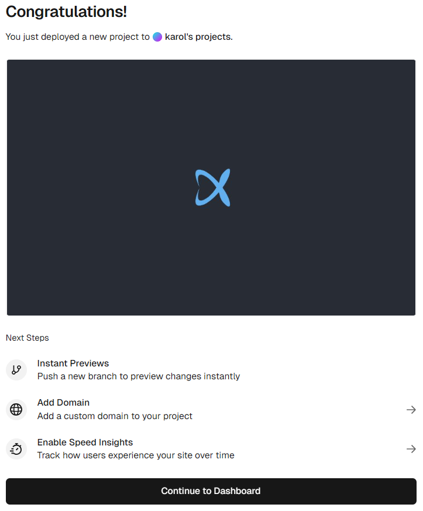

# leleo-home-page 个人主页

## 目录
- [项目简介](#项目简介)
- [功能特性](#功能特性)  
- [演示地址](#演示地址)
- [技术栈](#技术栈)
- [安装与运行](#安装与运行)
  - [本地运行](#本地运行)
  - [Vercel在线部署](#vercel在线部署)
- [配置文件](#配置文件)


## 项目简介

这是一个简单的个人主页项目，用于展示个人信息、技能、项目等。主页设计简洁、响应式，适合在不同设备上浏览。支持自定义配置。


## 功能特性

- **响应式设计**：适配桌面、平板和手机等不同设备
- **个人信息展示**：包括头像、个性标签、简介、技能等
- **项目展示**：展示项目，包括项目描述、技术栈和链接  
- **预览配置**：支持主题、背景壁纸预览（包括动、静态/PC、移动端壁纸设置）以及音乐播放配置
- **在线部署配置**：支持vercel一键部署及使用vercel环境变量进行在线自定义配置

## 演示地址

[在线演示](https://leleo.top)

## 技术栈

- **前端**：Vue
- **UI框架**：Vuetify  
- **构建工具**：Vite
- **版本控制**：Git
- **部署平台**：Vercel

## 安装与运行

### 本地运行

1. 克隆仓库：

```bash
git clone https://github.com/leleo886/leleo-home-page.git
```

2. 进入项目目录：

```bash
cd leleo-home-page
```

3. 安装依赖：

```bash
npm install
```

4. 启动开发服务器：

```bash
npm run dev
```

### Vercel在线部署

> 无需服务器，点击链接一键在线部署到 [Vercel](https://vercel.com/new/import?s=https://github.com/leleo886/leleo-home-page)


> ---登录账号，点击"Deploy"按钮开始部署



> ---部署完成后，点击回到控制面板


注意：Vercel提供的`.vercel.app`域名在中国大陆地区可能无法访问，所以建议绑定自定义域名。（若没有自己的域名，这里提供简单的[免费二级域名服务](https://sds.leleo.top)及本项目如何进行域名绑定的[说明](./img/domainToVercel.md)）

## 配置文件

方法1. 自己动手，有点麻烦
> 自定义数据文件为项目src目录下面的 config.js，这里有[配置说明](./img/config.md)，然后就是代码的拉取、修改上传。

方法2. vercel 环境变量，直接在线修改
> (1). 首先还是打开vercel中本项目主面板，然后依次点击`Settings`、`Environments`、`Production`


> (2). 然后下翻点击`Add Environment Variable`按钮，要求填入`Key`值为`VITE_CONFIG`,`Value`值如[环境变量值](./img/env.md)所示，全部复制粘贴即可（有点多），根据个人情况自定义修改，配置说明同方法1。


<p style="color: red;font-size:20px;margin-top:40px;">注意:</p>

每次修改环境变量后还需重新部署，否则数据无法更新。重新部署如下图，依次点击`Project`、`Build Logs`，进入新页面后再找到`Redeploy`。最后等待重新部署完成即可。


